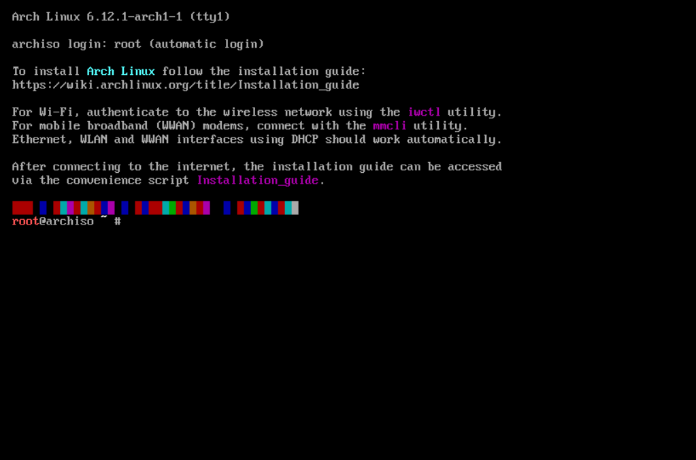
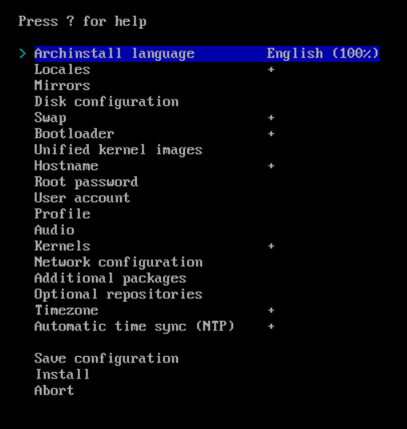

# Installation
In this article we'll be going over the installation process of arch linux from top to bottom. We will use the 
archinstall script for an easy installation.

## System Requirements
Arch doesn't really have system requirements but it's generally recommended to have the following for a smooth experience:
- 8GB of RAM
- At least 256GB of storage (preferably SSD instead of HDD)
- A 5th gen or newer intel or amd cpu

Don't be scared if your system doesn't meet these requirements, arch is super lightweight and fast so your system will probably be able to run arch, I've seen it running on 1GB of RAM and 4GB of storage.

## Prequisites
- A USB-stick of at least 8GB
- An arch linux iso image (downloadable [here](https://archlinux.org/download/))
- A functioning computer or android device (that you can plug your usb drive in)

## Making the bootable USB
Now you got all the prequisites figured out, you can start making your bootable USB drive by following the steps below
### On a computer: 
1. Go to the [balena etcher download page](https://etcher.balena.io/#download-etcher) and install it.
2. Open the balena etcher application and choose your arch linux iso image as the file.
3. Plug in your usb disk (**MAKE SURE THERE IS NOTHING IMPORTANT ON THERE ANYMORE**) and select it as the target.
4. Hit the "flash" button to start making the bootable usb (you might need to give administrator privileges).
5. You're done!
### On an android phone:
1. Download the EtchDroid app on the playstore from [here](https://play.google.com/store/apps/details?id=eu.depau.etchdroid&pli=1).
2. Click the "Write an image" button and choose your iso file.
3. Select your flash drive, grant access and then click "Write image"
4. Wait for a couple minutes and **DON'T TOUCH YOUR PHONE OR THE USB DRIVE"**.
5. You're done!

## Installation Boot
To install arch linux on your PC, you'll need to boot your laptop from the flash drive, to do so you need to diable secure boot. You can do so in the BIOS but accessing the BIOS is different on every laptop or PC. On many laptops you can do so by shutting your laptop down and then holding the f2, f12; delete or f9 key while booting back up, then go look in the security tab if there is one, otherwise just look it up for your device or motherboard.

Once you disabled secure boot, you can boot from the usb drive. To do so, it again depends on the brand of your motherboard or laptop, you can sometimes configure to boot from the usb drive in the BIOS settings but you can also most of the time get your machine to boot into a device selector so to know how to boot into the device selector, just look it up on the internet.

Once you're booting into the usb drive, just let everything do it's job until you're greeted with this screen or something similar:



Now for your own ease and comfort, plug in an ethernet cable or setup wired ethernet tethering from your phone, connecting to wifi is possible and you can do so by following [this](/docs/wifi.md) article but, connecting via a cable is just easier for the installation and also gives you a faster connection.

To start the installation process type in ```archinstall```, you don't have a mouse cursor right now but you can just typ and it'll work. after a small moment, you should see something like this:



This is the installer, and this is also where you configure some stuff before installing your system. I recommend going through everything but if you don't know something, you can probably leave it to the default.

Now, after configuring everything down, choose Install, follow the on-screen instructions and let it do it's thing.

## Chroot
after a while you'll be asked if you want to get into the newly installed chroot environment. It's basically a terminal environment from your newly installed system and you can do some stuff to your system but you can also say no, typ reboot and remove the usb drive to boot right into the fresh arch install!

## Post Install things
As far as post install goes, I think the most important thing is to update everything (```sudo pacman -Syu```) although you probably don't have any because arch always downloads the newest packages!

Succes with your system and have fun!
